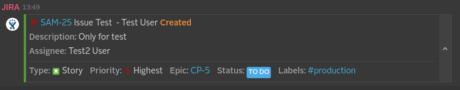

[](https://symphonyoss.atlassian.net/wiki/display/FM/Incubating) [](https://travis-ci.org/symphonyoss/App-Integrations-Jira)

# JIRA Webhook Integration
The JIRA Webhook Integration will allow you to receive notifications in Symphony whenever an issue-related event occurs inside of JIRA.

## [Build Instructions](#build-instructions-for-the-java-developer)

## How it works
If you are a JIRA admin user, you can configure a JIRA WebHook (as shown in the image below) using the URL generated in the JIRA Webhook Application to begin receiving notifications for the supported events.


## What formats and events it supports and what it produces
Every integration will receive a message sent in a specific format (depending on the system it ingests) and will usually convert it into an "entity" before it reaches the Symphony platform. It will also, usually, identify the kind of message based on an "event" identifier, which varies based on the third-party system.

You can find more details about entities and the Symphony Message ML format [here](https://github.com/symphonyoss/App-Integrations-Core#the-message-ml-format).

Currently we support the following five events from JIRA: issue created, issue updated, comment created, comment updated, and comment removed. Each one can be enabled when configuring your WebHook in the JIRA system configuration. Below we will detail each of the events. Included in each example is the JSON payload sent from JIRA, the Message ML generated by the Integration Bridge, and the message as it is rendered in Symphony.

### Issue Created

* [Issue Created JSON file](src/docs/sample/jiraCallbackSampleIssueCreatedWithEpic.json)
* Message ML generated by the parsers
```xml
<messageML>
  <entity type="com.symphony.integration.jira.event.created" version="1.0">
      <presentationML>
        Test User created Story SAM-25, Issue Test (<a href="https://whiteam1.atlassian.net/browse/SAM-25"/>)<br/>
        Assignee: Test2 User<br/>
        Labels:<hash tag="production"/><br/>
        Epic: CP-5 (<a href="https://whiteam1.atlassian.net/browse/CP-5"/>)<br/>
        Priority: Highest<br/>
        Status: To Do<br/>
        Description: Only for test
      </presentationML>
      <entity name="user" type="com.symphony.integration.jira.user" version="1.0">
          <attribute name="username" type="org.symphonyoss.string" value="test"/>
          <attribute name="emailAddress" type="org.symphonyoss.string" value="test@symphony.com"/>
          <attribute name="displayName" type="org.symphonyoss.string" value="Test User"/>
      </entity>
      <entity type="com.symphony.integration.jira.labels" version="1.0">
          <attribute name="production" type="org.symphonyoss.string" value="production"/>
      </entity>
      <entity type="com.symphony.integration.jira.epic" version="1.0">
          <attribute name="name" type="org.symphonyoss.string" value="CP-5"/>
          <attribute name="link" type="com.symphony.uri" value="https://whiteam1.atlassian.net/browse/CP-5"/>
      </entity>
      <entity type="com.symphony.integration.jira.issue" version="1.0">
          <attribute name="project" type="org.symphonyoss.string" value="Sample 1"/>
          <attribute name="key" type="org.symphonyoss.string" value="SAM-25"/>
          <attribute name="subject" type="org.symphonyoss.string" value="Issue Test"/>
          <attribute name="type" type="org.symphonyoss.string" value="Story"/>
          <attribute name="description" type="org.symphonyoss.string" value="Only for test"/>
          <attribute name="link" type="com.symphony.uri" value="https://whiteam1.atlassian.net/browse/SAM-25"/>
          <attribute name="priority" type="org.symphonyoss.string" value="Highest"/>
          <attribute name="status" type="org.symphonyoss.string" value="To Do"/>
          <entity name="assignee" type="com.symphony.integration.jira.user" version="1.0">
              <attribute name="username" type="org.symphonyoss.string" value="test2"/>
              <attribute name="emailAddress" type="org.symphonyoss.string" value="test2@symphony.com"/>
              <attribute name="displayName" type="org.symphonyoss.string" value="Test2 User"/>
          </entity>
      </entity>
  </entity>
</messageML>
```
* Message rendered on Symphony



### Issue Updated

* [Issue Updated JSON file](src/docs/sample/jiraCallbackSampleIssueUpdated.json)
* Message ML generated by the parsers
```xml
<messageML>
  <entity type="com.symphony.integration.jira.event.updated" version="1.0">
    <presentationML>Test User updated Bug SAM-24, Sample Bug Blocker (<a href="https://whiteam1.atlassian.net/browse/SAM-24"/>) to <b>Done</b><br/>Assignee: Test2 User<br/>Labels: <hash tag="production"/><br/>Priority: Highest<br/>Status: Done<br/>Description: </presentationML>
    <entity name="user" type="com.symphony.integration.jira.user" version="1.0">
      <attribute name="username" type="org.symphonyoss.string" value="test" />
      <attribute name="emailAddress" type="org.symphonyoss.string" value="test@symphony.com" />
      <attribute name="displayName" type="org.symphonyoss.string" value="Test User" />
    </entity>
    <entity type="com.symphony.integration.jira.labels" version="1.0">
      <attribute name="production" type="org.symphonyoss.string" value="production" />
    </entity>
    <entity type="com.symphony.integration.jira.issue" version="1.0">
      <attribute name="project" type="org.symphonyoss.string" value="Sample 1" />
      <attribute name="key" type="org.symphonyoss.string" value="SAM-24" />
      <attribute name="subject" type="org.symphonyoss.string" value="Sample Bug Blocker" />
      <attribute name="type" type="org.symphonyoss.string" value="Bug" />
      <attribute name="link" type="com.symphony.uri" value="https://whiteam1.atlassian.net/browse/SAM-24" />
      <attribute name="priority" type="org.symphonyoss.string" value="Highest" />
      <attribute name="status" type="org.symphonyoss.string" value="Done" />
      <entity name="assignee" type="com.symphony.integration.jira.user" version="1.0">
        <attribute name="username" type="org.symphonyoss.string" value="test2" />
        <attribute name="emailAddress" type="org.symphonyoss.string" value="test2@symphony.com" />
        <attribute name="displayName" type="org.symphonyoss.string" value="Test2 User" />
      </entity>
    </entity>
    <entity type="com.symphony.integration.jira.changelog" version="1.0">
      <entity type="com.symphony.integration.jira.change" version="1.0">
        <attribute name="fieldName" type="org.symphonyoss.string" value="resolution" />
        <attribute name="oldValue" type="org.symphonyoss.string" value="null" />
        <attribute name="newValue" type="org.symphonyoss.string" value="Done" />
      </entity>
      <entity type="com.symphony.integration.jira.change" version="1.0">
        <attribute name="fieldName" type="org.symphonyoss.string" value="status" />
        <attribute name="oldValue" type="org.symphonyoss.string" value="To Do" />
        <attribute name="newValue" type="org.symphonyoss.string" value="Done" />
      </entity>
    </entity>
  </entity>
</messageML>
```
* Message rendered on Symphony (since this sample does not have a "description" tag, it will show as "n/a")


### Comment Created

* [Comment Created JSON file](src/docs/sample/jiraCallbackSampleCommentAdded.json)
* Message ML generated by the parsers
```xml
<messageML>
  <entity type="com.symphony.integration.jira.event.issue_commented" version="1.0">
    <presentationML>Test User commented on Story SAM-25, Issue Test (<a href="https://whiteam1.atlassian.net/browse/SAM-25"/>)<br/>Comment: Hey, this is another test comment!</presentationML>
    <entity name="user" type="com.symphony.integration.jira.user" version="1.0">
      <attribute name="username" type="org.symphonyoss.string" value="test" />
      <attribute name="emailAddress" type="org.symphonyoss.string" value="test@symphony.com" />
      <attribute name="displayName" type="org.symphonyoss.string" value="Test User" />
    </entity>
    <entity type="com.symphony.integration.jira.labels" version="1.0">
      <attribute name="production" type="org.symphonyoss.string" value="production" />
      <attribute name="test" type="org.symphonyoss.string" value="test" />
    </entity>
    <entity type="com.symphony.integration.jira.issue" version="1.0">
      <attribute name="project" type="org.symphonyoss.string" value="Sample 1" />
      <attribute name="key" type="org.symphonyoss.string" value="SAM-25" />
      <attribute name="subject" type="org.symphonyoss.string" value="Issue Test" />
      <attribute name="type" type="org.symphonyoss.string" value="Story" />
      <attribute name="description" type="org.symphonyoss.string" value="Only for test" />
      <attribute name="link" type="com.symphony.uri" value="https://whiteam1.atlassian.net/browse/SAM-25" />
      <attribute name="priority" type="org.symphonyoss.string" value="Highest" />
      <attribute name="status" type="org.symphonyoss.string" value="To Do" />
      <attribute name="author" type="org.symphonyoss.string" value="Milton2" />
      <entity name="assignee" type="com.symphony.integration.jira.user" version="1.0">
        <attribute name="username" type="org.symphonyoss.string" value="test" />
        <attribute name="emailAddress" type="org.symphonyoss.string" value="test@symphony.com" />
        <attribute name="displayName" type="org.symphonyoss.string" value="Test User" />
      </entity>
      <entity type="com.symphony.integration.jira.comment" version="1.0">
        <attribute name="comment" type="org.symphonyoss.string" value="Hey, this is another test comment!" />
      </entity>
    </entity>
  </entity>
</messageML>
```
* Message rendered on Symphony


### Comment Updated

* [Comment Updated JSON file](src/docs/sample/jiraCallbackSampleCommentUpdated.json)
* Message ML generated by the parsers
```xml
<messageML>
  <entity type="com.symphony.integration.jira.event.issue_comment_edited" version="1.0">
    <presentationML>Milton Gonçalves Quilzini edited a comment on Story ADM5-2, Test Story (<a href="https://ppires.atlassian.net/browse/ADM5-2"/>)<br/>Comment: Comment Edited...</presentationML>
    <entity name="user" type="com.symphony.integration.jira.user" version="1.0">
      <attribute name="username" type="org.symphonyoss.string" value="mquilzini" />
      <attribute name="emailAddress" type="org.symphonyoss.string" value="mquilzini@symphony.com" />
      <attribute name="displayName" type="org.symphonyoss.string" value="Milton Gonçalves Quilzini" />
    </entity>
    <entity type="com.symphony.integration.jira.issue" version="1.0">
      <attribute name="project" type="org.symphonyoss.string" value="admin&amp;apos;s Project" />
      <attribute name="key" type="org.symphonyoss.string" value="ADM5-2" />
      <attribute name="subject" type="org.symphonyoss.string" value="Test Story" />
      <attribute name="type" type="org.symphonyoss.string" value="Story" />
      <attribute name="link" type="com.symphony.uri" value="https://ppires.atlassian.net/browse/ADM5-2" />
      <attribute name="priority" type="org.symphonyoss.string" value="Medium" />
      <attribute name="status" type="org.symphonyoss.string" value="To Do" />
      <attribute name="author" type="org.symphonyoss.string" value="Milton Gonçalves Quilzini" />
      <entity name="assignee" type="com.symphony.integration.jira.user" version="1.0">
        <attribute name="username" type="org.symphonyoss.string" value="admin" />
        <attribute name="emailAddress" type="org.symphonyoss.string" value="ppires@symphony.com" />
        <attribute name="displayName" type="org.symphonyoss.string" value="Paulo  [Administrator]" />
      </entity>
      <entity type="com.symphony.integration.jira.comment" version="1.0">
        <attribute name="comment" type="org.symphonyoss.string" value="Comment Edited..." />
      </entity>
    </entity>
  </entity>
</messageML>
```
* Message rendered on Symphony


### Comment Removed

* [Comment Removed JSON file](src/docs/sample/jiraCallbackSampleCommentDeleted.json)
* Message ML generated by the parsers
```xml
<messageML>
  <entity type="com.symphony.integration.jira.event.issue_comment_deleted" version="1.0">
    <presentationML>Milton Gonçalves Quilzini deleted a comment on Story ADM5-2, Test Story (<a href="https://ppires.atlassian.net/browse/ADM5-2"/>)</presentationML>
    <entity name="user" type="com.symphony.integration.jira.user" version="1.0">
      <attribute name="username" type="org.symphonyoss.string" value="mquilzini" />
      <attribute name="emailAddress" type="org.symphonyoss.string" value="mquilzini@symphony.com" />
      <attribute name="displayName" type="org.symphonyoss.string" value="Milton Gonçalves Quilzini" />
    </entity>
    <entity type="com.symphony.integration.jira.issue" version="1.0">
      <attribute name="project" type="org.symphonyoss.string" value="admin&amp;apos;s Project" />
      <attribute name="key" type="org.symphonyoss.string" value="ADM5-2" />
      <attribute name="subject" type="org.symphonyoss.string" value="Test Story" />
      <attribute name="type" type="org.symphonyoss.string" value="Story" />
      <attribute name="link" type="com.symphony.uri" value="https://ppires.atlassian.net/browse/ADM5-2" />
      <attribute name="priority" type="org.symphonyoss.string" value="Medium" />
      <attribute name="status" type="org.symphonyoss.string" value="To Do" />
      <entity name="assignee" type="com.symphony.integration.jira.user" version="1.0">
        <attribute name="username" type="org.symphonyoss.string" value="admin" />
        <attribute name="emailAddress" type="org.symphonyoss.string" value="ppires@symphony.com" />
        <attribute name="displayName" type="org.symphonyoss.string" value="Paulo  [Administrator]" />
      </entity>
    </entity>
  </entity>
</messageML>
```
* Message rendered on Symphony


# Build instructions for the Java developer

## What you’ll build
You’ll build an integration module to be used with the [Integration Bridge](https://github.com/symphonyoss/App-Integrations-Core).

If you develop a new integration, to get it up and running you'll also need to add it to the core project's web pom file.

## What you’ll need
* JDK 1.7
* Maven 3.0.5+
* Node 6.10
* Gulp (globally installed)
* Webpack (globally installed)

## Build with maven
JIRA WebHook Integration is compatible with Apache Maven 3.0.5 or above. If you don’t already have Maven installed you can follow the instructions at maven.apache.org.

To start from scratch, do the following:

1. Build the _App-Integrations-Jira_ dependencies (so you have them in your Maven local repository):
> [_App-Integrations-Commons_](https://github.com/symphonyoss/App-Integrations-Commons)
2. Clone the source repository using Git: `git clone git@github.com:symphonyoss/App-Integrations-Jira.git`
3. cd into _App-Integrations-Jira_
4. Build using maven: `mvn clean install`

## Run locally

1. Define your certificate paths and passwords
```
cp local-run/env.sh.sample env.sh
open env.sh
```

Make sure that
- Paths and passwords are correct
- You can reach all Symphony Pod endpoints
- Service accounts exists and cert CNs match with account's usernames. **_Note: The team is working on a integration-provisioning module that will automate this process; until further notice, please contact Symphony Support to get your Symphony integration deployed on your pod, as the pod will need an exact match of service account name, certs and app name in the pod for your app to be visible in your pod and usable._**
- `./env.sh`, `./application.yaml` and `./certs/` are ignored by Git and don't end up in any code repository

2. Run the integrations
```
./run.sh
```

This command will create an `application.yaml` file in the project root folder, using `local-run/application.yaml.template` as template.

## Expose local endpoint to a public host

In order to be able to create the app in the Foundation pod, you must provide a public `App Url`; you can use [ngrok](https://ngrok.com/) (or similar) to tunnel your local connection and expose it via a public DNS:
```
ngrok http 8080
```
Your local port 8080 is now accessible via `<dynamic_id>.ngrok.io`

If you have a paid subscription, you can also use
```
ngrok http -subdomain=my.static.subdomain 8080
```

## Add your locally running application to the Symphony Market

Adjust your [bundle.json](src/main/webapp/bundle.json) located src/main/webapp/ with the URL you are exposing via ngrok, the configuration and bot id's, and the application context.

**_Note: The team is working on a integration-provisioning module that will automate this process; until further notice, please contact Symphony Support to get your configuration and bot id's.

For the application context, you should always user app/<your app id> provided in the env.sh. That id should also match what you have on [application-jira.yml](src/main/resources/application-jira.yml)

For instance, see apps/jira present in the URL's for the controller.html and appstore-logo.png, as well as in the **context** query parameter for the controller:

```
{
  "applications": [
    {
      "type": "sandbox",
      "id": "devZapierWebHookIntegration",
      "name": "Zapier",
      "blurb": "Zapier Webhook Integration in Development Mode",
      "publisher": "Symphony",
      "url": "https://d74a790c.ngrok.io/apps/jira/controller.html?configurationId=58598bffe4b057438e69f527&botUserId=346621040656489&id=devZapierWebHookIntegration&context=apps/jira",
      "icon": "https://d74a790c.ngrok.io/apps/jira/img/appstore-logo.png",
      "domain": ".ngrok.io"
    }
  ]
}
```

Access the application icon on your browser to make sure it works and to accept any unsafe certificates (if necessary). In the above example, the URL to acces is https://6f3420e6.ngrok.io/img/appstore-logo.png).

**Run your application again as indicated above, to get the new bundle.js information packaged.**

Launch the Symphony client on your browser, adding your bundle.js as path of the query parameters in the URL. For instance, using the Foundation Dev Pod with the above ngrok sample URL: https://foundation-dev.symphony.com?bundle=https://d74a790c.ngrok.io/apps/jira/bundle.json.

Access the Symphony Market on the browser, and you should be notified to allow unauthorized apps. That is your development app added through bundle.json. Accept the notification and you should see your application in the application list, with the name and description provided in the bundle.json.
