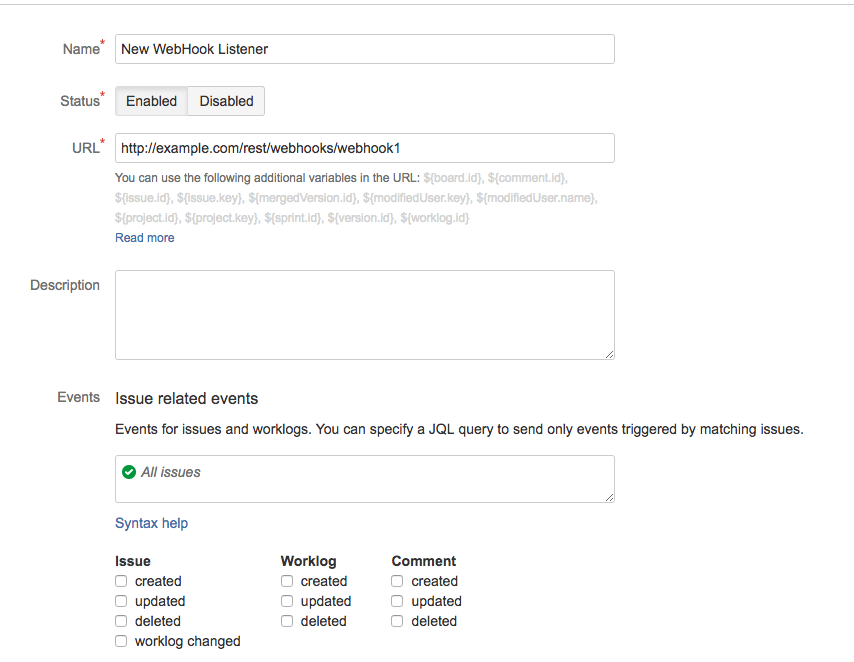
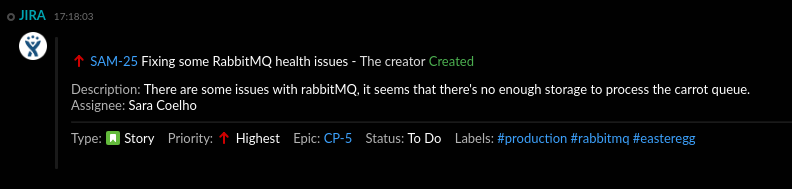

[](https://symphonyoss.atlassian.net/wiki/display/FM/Incubating) [](https://travis-ci.org/symphonyoss/App-Integrations-Jira) [](https://www.versioneye.com/user/projects/58d049f56893fd004792c870)

# JIRA Webhook Integration
The JIRA Webhook Integration will allow you to receive notifications in Symphony whenever an issue-related event occurs inside of JIRA.

## [Build Instructions](#build-instructions-for-the-java-developer)

## How it works
If you are a JIRA admin user, you can configure a JIRA WebHook (as shown in the image below) using the URL generated in the JIRA Webhook Application to begin receiving notifications for the supported events.



## What formats and events it supports and what it produces
Every integration will receive a message sent in a specific format (depending on the system it ingests) and will usually convert it into an internal format before it reaches the Symphony platform. It will also, usually, identify the kind of message based on an "event" identifier, which varies based on the third-party system.

Currently we support the following five events from JIRA: issue created, issue updated, comment created, comment updated, and comment removed. Each one can be enabled when configuring your WebHook in the JIRA system configuration.
Below we will detail one event as an example. This example has the JSON payload sent by JIRA's webhook, the Message ML v2 and EntityJSON generated by the Integration Bridge, and how the message is rendered on Symphony.

### An Example: Issue Created
Here we will show a sample payload of an issue created on Jira, with the received payload, the MessageML generated by the Integration Bridge, and the message as it is rendered in Symphony.

##### Message sent from Jira webhook 
* [Issue Created JSON file](src/docs/sample/jiraCallbackSampleIssueCreatedWithEpic.json)

##### MessageML and JSON entity supported by the Jira Webhook Integration (MessageML v2)
When the Integration Bridge posts messages through the Agent that has version equal or greater than '1.46.0' the
generated Symphony Message must follow the MessageML V2 specification.

The Jira integration on the Integration Bridge parses the JSON payload that Jira sent, and generates messageMLv2 and EntityJSON. 

More information about MessageML V2 specification can be accessed [here](https://symphonyoss.atlassian.net/wiki/display/WGFOS/MessageML+V2+Draft+Proposal+-+For+Discussion)

###### MessageML
This is the messageML v2 that the Jira integration generates after parsing, which defines the layout of the card and how the front end will render it within Symphony:

```xml
<messageML>
    <div class="entity" data-entity-id="jiraIssue">
        <card class="barStyle" accent="green" iconSrc="${entity['jiraIssue'].icon.url}">
            <header>
                <p>
                    
                    <a class="tempo-text-color--link" href="${entity['jiraIssue'].issue.url}">${entity['jiraIssue'].issue.key}</a>
                    <span class="tempo-text-color--normal">${entity['jiraIssue'].issue.subject} - </span>
                    <#if (entity['jiraIssue'].user.id)??>
                        <mention email="${entity['jiraIssue'].user.emailAddress}" />
                    <#else>
                        <span>${entity['jiraIssue'].user.displayName}</span>
                    </#if>
                    <span class="tempo-text-color--green">${entity['jiraIssue'].issue.action}</span>
                </p>
            </header>
            <body>
                <div class="labelBackground badge">
                    <p>
                        <#if (entity['jiraIssue'].issue.description)??>
                            <span class="tempo-text-color--secondary">Description:</span>
                            <span class="tempo-text-color--normal">${entity['jiraIssue'].issue.description}</span>
                        </#if>

                        <br/>
                        <span class="tempo-text-color--secondary">Assignee:</span>
                        <#if (entity['jiraIssue'].issue.assignee.id)??>
                            <mention email="${entity['jiraIssue'].issue.assignee.emailAddress}" />
                        <#else>
                            <span class="tempo-text-color--normal">${entity['jiraIssue'].issue.assignee.displayName}</span>
                        </#if>
                    </p>
                    <p>
                        <span class="label">Type:</span>
                        
                        <span class="tempo-text-color--normal">${entity['jiraIssue'].issue.issueType.name}</span>

                        <br/>
                        <span class="tempo-text-color--secondary">Priority:</span>
                        
                        <span class="tempo-text-color--normal">${entity['jiraIssue'].issue.priority.name}</span>


                        <#if (entity['jiraIssue'].issue.epic)??>
                            <br/>
                            <span class="tempo-text-color--secondary">Epic:</span>
                            <a href="${entity['jiraIssue'].issue.epic.link}">${entity['jiraIssue'].issue.epic.name}</a>
                        </#if>

                        <br/>
                        <span class="tempo-text-color--secondary">Status:</span>
                        <span class="tempo-text-color--normal">${entity['jiraIssue'].issue.status?capitalize}</span>


                        <#if (entity['jiraIssue'].issue.labels)??>
                            <br/>
                            <span class="tempo-text-color--secondary">Labels:</span>
                            <#list entity['jiraIssue'].issue.labels as label>
                                <span class="hashTag">#${label.text}</span>
                            </#list>
                        </#if>
                    </p>
                </div>
            </body>
        </card>
    </div>
</messageML>
```
###### Entity JSON
This is the EntityJSON that the Jira integration generates after parsing, which defines the content of the card that the front-end will use in combination with the MessageML v2 to render the card:
```json
{
  "jiraIssue": {
    "type": "com.symphony.integration.jira.event.v2.state",
    "version": "1.0",
    "icon": {
      "type": "com.symphony.integration.icon",
      "version": "1.0",
      "url": "https://nexus2.symphony.com/apps/jira/img/jira_logo_rounded.png"
    },
    "user": {
      "type": "com.symphony.integration.user",
      "version": "1.0",
      "emailAddress": "test@symphony.com",
      "displayName": "The creator"
    },
    "issue": {
      "type": "com.symphony.integration.jira.issue",
      "version": "1.0",
      "key": "SAM-25",
      "url": "https://jira.atlassian.com/browse/SAM-25",
      "subject": "Fixing some RabbitMQ health issues",
      "description": "There are some issues with rabbitMQ, it seems that there&apos;s no enough storage to process the carrot queue.",
      "status": "TO DO",
      "action": "Created",
      "issueType": {
        "type": "com.symphony.integration.jira.issueType",
        "version": "1.0",
        "name": "Story",
        "iconUrl": "https://jira.atlassian.com/images/icons/issuetypes/story.svg"
      },
      "priority": {
        "type": "com.symphony.integration.jira.priority",
        "version": "1.0",
        "iconUrl": "https://jira.atlassian.com/images/icons/priorities/highest.svg",
        "name": "Highest"
      },
      "assignee": {
        "type": "com.symphony.integration.user",
        "version": "1.0",
        "emailAddress": "sara.coelho@symphony.com",
        "displayName": "Sara Coelho"
      },
      "epic": {
        "type": "com.symphony.integration.jira.epic",
        "version": "1.0",
        "name": "CP-5",
        "link": "https://jira.atlassian.com/browse/CP-5"
      },
      "labels": [
        {
          "type": "com.symphony.integration.jira.label",
          "version": "1.0",
          "text": "production"
        },
        {
          "type": "com.symphony.integration.jira.label",
          "version": "1.0",
          "text": "rabbitmq"
        },
        {
          "type": "com.symphony.integration.jira.label",
          "version": "1.0",
          "text": "easteregg"
        }
      ]
    }
  }
}
```
##### Message rendered in Symphony



# Build instructions for the Java developer

### What you’ll build
You’ll build an integration module to be used with the [Integration Bridge](https://github.com/symphonyoss/App-Integrations-Core).

If you develop a new integration, to get it up and running you'll also need to add it to the core project's web pom file.

### What you’ll need
* JDK 1.7
* Maven 3.0.5+

### Build with maven
JIRA WebHook Integration is compatible with Apache Maven 3.0.5 or above. If you don’t already have Maven installed you can follow the instructions at maven.apache.org.

To start from scratch, do the following:

1. Build the _App-Integrations-Jira_ dependencies (so you have them in your Maven local repository):
> [_App-Integrations-Commons_](https://github.com/symphonyoss/App-Integrations-Commons)
2. Clone the source repository using Git: `git clone git@github.com:symphonyoss/App-Integrations-Jira.git`
3. cd into _App-Integrations-Jira_
4. Build using maven: `mvn clean install`
