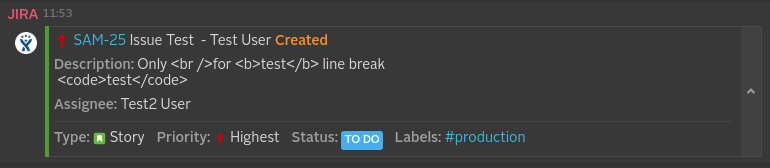
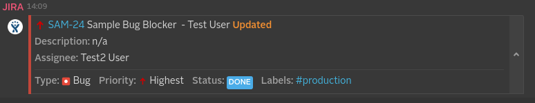
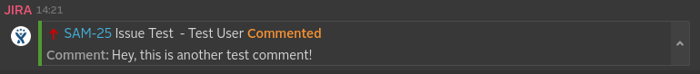
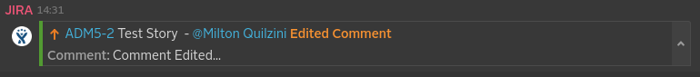
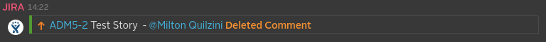

_Note that this project depends on internal Symphony infrastructure (repository.symphony.com), and therefore it can only be built by Symphony LLC employees/partners._

# JIRA Webhook Integration
The JIRA Webhook Integration will allow you to receive notifications in Symphony whenever one of your JIRA issues is created or updated.

## How it works
If you are a JIRA admin user, you can configure your JIRA WebHook to point it to the URL you generate in the JIRA Webhook Integration configuration pane and then you'll start receiving notifications for the supported events.

## What formats and events it supports and what it produces
Every integration will get a message sent in a specific format (depending on what system is it dealing with) and it will usually convert it into an "entity" before it reaches the Symphony platform.
It will also, usually, identify the kind of message it will deal with based on an "event" identifier, that varies based on which system is it integrating with.

Currently we are supporting the following five events from JIRA: *issue created, issue updated, comment created, comment updated, comment removed*.
Those can be found directly when configuring your WebHook events on JIRA system configuration.

Below we'll detail each one of those events

### Issue Created

* Jira JSON message sent
[Issue Created JSON file](src/docs/sample/jiraCallbackSampleIssueCreated.json)
* Message ML generated by the parsers
```xml
<messageML>
  <entity type="com.symphony.integration.jira.event.created" version="1.0">
    <presentationML>Test User created Story SAM-25, Issue Test (<a href="https://whiteam1.atlassian.net/browse/SAM-25"/>)<br/>Assignee: Test2 User<br/>Labels: <hash tag="production"/><br/>Priority: Highest<br/>Status: To Do<br/>Description: Only &amp;lt;br /&amp;gt;for &amp;lt;b&amp;gt;test&amp;lt;/b&amp;gt; line break&lt;br/&gt; &amp;lt;code&amp;gt;test&amp;lt;/code&amp;gt;</presentationML>
    <entity name="user" type="com.symphony.integration.jira.user" version="1.0">
      <attribute name="username" type="org.symphonyoss.string" value="test"/>
      <attribute name="emailAddress" type="org.symphonyoss.string" value="test@symphony.com"/>
      <attribute name="displayName" type="org.symphonyoss.string" value="Test User"/>
    </entity>
      <entity type="com.symphony.integration.jira.labels" version="1.0">
      <attribute name="production" type="org.symphonyoss.string" value="production"/>
    </entity>
    <entity type="com.symphony.integration.jira.issue" version="1.0">
      <attribute name="project" type="org.symphonyoss.string" value="Sample 1"/>
      <attribute name="key" type="org.symphonyoss.string" value="SAM-25"/>
      <attribute name="subject" type="org.symphonyoss.string" value="Issue Test"/>
      <attribute name="type" type="org.symphonyoss.string" value="Story"/>
      <attribute name="description" type="org.symphonyoss.string" value="Only &amp;lt;br /&amp;gt;for &amp;lt;b&amp;gt;test&amp;lt;/b&amp;gt; line break&lt;br/&gt; &amp;lt;code&amp;gt;test&amp;lt;/code&amp;gt;"/>
      <attribute name="link" type="com.symphony.uri" value="https://whiteam1.atlassian.net/browse/SAM-25"/>
      <attribute name="priority" type="org.symphonyoss.string" value="Highest"/>
      <attribute name="status" type="org.symphonyoss.string" value="To Do"/>
      <entity name="assignee" type="com.symphony.integration.jira.user" version="1.0">
        <attribute name="username" type="org.symphonyoss.string" value="test2"/>
        <attribute name="emailAddress" type="org.symphonyoss.string" value="test2@symphony.com"/>
        <attribute name="displayName" type="org.symphonyoss.string" value="Test2 User"/>
      </entity>
    </entity>
  </entity>
</messageML>
```
* Message rendered on Symphony



### Issue Updated

* Jira JSON message sent
[Issue Updated JSON file](src/docs/sample/jiraCallbackSampleIssueUpdated.json)
* Message ML generated by the parsers
```xml
<messageML>
  <entity type="com.symphony.integration.jira.event.updated" version="1.0">
    <presentationML>Test User updated Bug SAM-24, Sample Bug Blocker (<a href="https://whiteam1.atlassian.net/browse/SAM-24"/>) to <b>Done</b><br/>Assignee: Test2 User<br/>Labels: <hash tag="production"/><br/>Priority: Highest<br/>Status: Done<br/>Description: </presentationML>
    <entity name="user" type="com.symphony.integration.jira.user" version="1.0">
      <attribute name="username" type="org.symphonyoss.string" value="test" />
      <attribute name="emailAddress" type="org.symphonyoss.string" value="test@symphony.com" />
      <attribute name="displayName" type="org.symphonyoss.string" value="Test User" />
    </entity>
    <entity type="com.symphony.integration.jira.labels" version="1.0">
      <attribute name="production" type="org.symphonyoss.string" value="production" />
    </entity>
    <entity type="com.symphony.integration.jira.issue" version="1.0">
      <attribute name="project" type="org.symphonyoss.string" value="Sample 1" />
      <attribute name="key" type="org.symphonyoss.string" value="SAM-24" />
      <attribute name="subject" type="org.symphonyoss.string" value="Sample Bug Blocker" />
      <attribute name="type" type="org.symphonyoss.string" value="Bug" />
      <attribute name="link" type="com.symphony.uri" value="https://whiteam1.atlassian.net/browse/SAM-24" />
      <attribute name="priority" type="org.symphonyoss.string" value="Highest" />
      <attribute name="status" type="org.symphonyoss.string" value="Done" />
      <entity name="assignee" type="com.symphony.integration.jira.user" version="1.0">
        <attribute name="username" type="org.symphonyoss.string" value="test2" />
        <attribute name="emailAddress" type="org.symphonyoss.string" value="test2@symphony.com" />
        <attribute name="displayName" type="org.symphonyoss.string" value="Test2 User" />
      </entity>
    </entity>
    <entity type="com.symphony.integration.jira.changelog" version="1.0">
      <entity type="com.symphony.integration.jira.change" version="1.0">
        <attribute name="fieldName" type="org.symphonyoss.string" value="resolution" />
        <attribute name="oldValue" type="org.symphonyoss.string" value="null" />
        <attribute name="newValue" type="org.symphonyoss.string" value="Done" />
      </entity>
      <entity type="com.symphony.integration.jira.change" version="1.0">
        <attribute name="fieldName" type="org.symphonyoss.string" value="status" />
        <attribute name="oldValue" type="org.symphonyoss.string" value="To Do" />
        <attribute name="newValue" type="org.symphonyoss.string" value="Done" />
      </entity>
    </entity>
  </entity>
</messageML>
```
* Message rendered on Symphony



### Comment Created

* Jira JSON message sent
[Comment Created JSON file](src/docs/sample/jiraCallbackSampleCommentAdded.json)
* Message ML generated by the parsers
```xml
<messageML>
  <entity type="com.symphony.integration.jira.event.issue_commented" version="1.0">
    <presentationML>Test User commented on Story SAM-25, Issue Test (<a href="https://whiteam1.atlassian.net/browse/SAM-25"/>)<br/>Comment: Hey, this is another test comment!</presentationML>
    <entity name="user" type="com.symphony.integration.jira.user" version="1.0">
      <attribute name="username" type="org.symphonyoss.string" value="test" />
      <attribute name="emailAddress" type="org.symphonyoss.string" value="test@symphony.com" />
      <attribute name="displayName" type="org.symphonyoss.string" value="Test User" />
    </entity>
    <entity type="com.symphony.integration.jira.labels" version="1.0">
      <attribute name="production" type="org.symphonyoss.string" value="production" />
      <attribute name="test" type="org.symphonyoss.string" value="test" />
    </entity>
    <entity type="com.symphony.integration.jira.issue" version="1.0">
      <attribute name="project" type="org.symphonyoss.string" value="Sample 1" />
      <attribute name="key" type="org.symphonyoss.string" value="SAM-25" />
      <attribute name="subject" type="org.symphonyoss.string" value="Issue Test" />
      <attribute name="type" type="org.symphonyoss.string" value="Story" />
      <attribute name="description" type="org.symphonyoss.string" value="Only for test" />
      <attribute name="link" type="com.symphony.uri" value="https://whiteam1.atlassian.net/browse/SAM-25" />
      <attribute name="priority" type="org.symphonyoss.string" value="Highest" />
      <attribute name="status" type="org.symphonyoss.string" value="To Do" />
      <attribute name="author" type="org.symphonyoss.string" value="Milton2" />
      <entity name="assignee" type="com.symphony.integration.jira.user" version="1.0">
        <attribute name="username" type="org.symphonyoss.string" value="test" />
        <attribute name="emailAddress" type="org.symphonyoss.string" value="test@symphony.com" />
        <attribute name="displayName" type="org.symphonyoss.string" value="Test User" />
      </entity>
      <entity type="com.symphony.integration.jira.comment" version="1.0">
        <attribute name="comment" type="org.symphonyoss.string" value="Hey, this is another test comment!" />
      </entity>
    </entity>
  </entity>
</messageML>
```
* Message rendered on Symphony



### Comment Updated

* Jira JSON message sent
[Comment Updated JSON file](src/docs/sample/jiraCallbackSampleCommentUpdated.json)
* Message ML generated by the parsers
```xml
<messageML>
  <entity type="com.symphony.integration.jira.event.issue_comment_edited" version="1.0">
    <presentationML>Milton Gonçalves Quilzini edited a comment on Story ADM5-2, Test Story (<a href="https://ppires.atlassian.net/browse/ADM5-2"/>)<br/>Comment: Comment Edited...</presentationML>
    <entity name="user" type="com.symphony.integration.jira.user" version="1.0">
      <attribute name="username" type="org.symphonyoss.string" value="mquilzini" />
      <attribute name="emailAddress" type="org.symphonyoss.string" value="mquilzini@symphony.com" />
      <attribute name="displayName" type="org.symphonyoss.string" value="Milton Gonçalves Quilzini" />
    </entity>
    <entity type="com.symphony.integration.jira.issue" version="1.0">
      <attribute name="project" type="org.symphonyoss.string" value="admin&amp;apos;s Project" />
      <attribute name="key" type="org.symphonyoss.string" value="ADM5-2" />
      <attribute name="subject" type="org.symphonyoss.string" value="Test Story" />
      <attribute name="type" type="org.symphonyoss.string" value="Story" />
      <attribute name="link" type="com.symphony.uri" value="https://ppires.atlassian.net/browse/ADM5-2" />
      <attribute name="priority" type="org.symphonyoss.string" value="Medium" />
      <attribute name="status" type="org.symphonyoss.string" value="To Do" />
      <attribute name="author" type="org.symphonyoss.string" value="Milton Gonçalves Quilzini" />
      <entity name="assignee" type="com.symphony.integration.jira.user" version="1.0">
        <attribute name="username" type="org.symphonyoss.string" value="admin" />
        <attribute name="emailAddress" type="org.symphonyoss.string" value="ppires@symphony.com" />
        <attribute name="displayName" type="org.symphonyoss.string" value="Paulo  [Administrator]" />
      </entity>
      <entity type="com.symphony.integration.jira.comment" version="1.0">
        <attribute name="comment" type="org.symphonyoss.string" value="Comment Edited..." />
      </entity>
    </entity>
  </entity>
</messageML>
```
* Message rendered on Symphony



### Comment Removed

* Jira JSON message sent
[Comment Removed JSON file](src/docs/sample/jiraCallbackSampleCommentDeleted.json)
* Message ML generated by the parsers
```xml
<messageML>
  <entity type="com.symphony.integration.jira.event.issue_comment_deleted" version="1.0">
    <presentationML>Milton Gonçalves Quilzini deleted a comment on Story ADM5-2, Test Story (<a href="https://ppires.atlassian.net/browse/ADM5-2"/>)</presentationML>
    <entity name="user" type="com.symphony.integration.jira.user" version="1.0">
      <attribute name="username" type="org.symphonyoss.string" value="mquilzini" />
      <attribute name="emailAddress" type="org.symphonyoss.string" value="mquilzini@symphony.com" />
      <attribute name="displayName" type="org.symphonyoss.string" value="Milton Gonçalves Quilzini" />
    </entity>
    <entity type="com.symphony.integration.jira.issue" version="1.0">
      <attribute name="project" type="org.symphonyoss.string" value="admin&amp;apos;s Project" />
      <attribute name="key" type="org.symphonyoss.string" value="ADM5-2" />
      <attribute name="subject" type="org.symphonyoss.string" value="Test Story" />
      <attribute name="type" type="org.symphonyoss.string" value="Story" />
      <attribute name="link" type="com.symphony.uri" value="https://ppires.atlassian.net/browse/ADM5-2" />
      <attribute name="priority" type="org.symphonyoss.string" value="Medium" />
      <attribute name="status" type="org.symphonyoss.string" value="To Do" />
      <entity name="assignee" type="com.symphony.integration.jira.user" version="1.0">
        <attribute name="username" type="org.symphonyoss.string" value="admin" />
        <attribute name="emailAddress" type="org.symphonyoss.string" value="ppires@symphony.com" />
        <attribute name="displayName" type="org.symphonyoss.string" value="Paulo  [Administrator]" />
      </entity>
    </entity>
  </entity>
</messageML>
```
* Message rendered on Symphony


